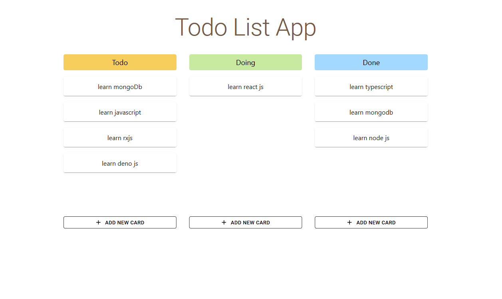

# Todo List App

Simple todo application with node and mongodb as backend and react, redux, typescript, material ui as frontend

## Installation

- `git clone <this_url> && cd <repo_name>`
  - `cd client`
  - `npm install or yarn install`
  - `cd server`
  - `npm install or yarn install`
